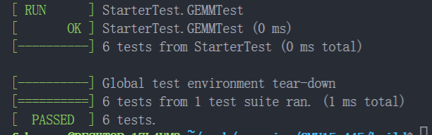
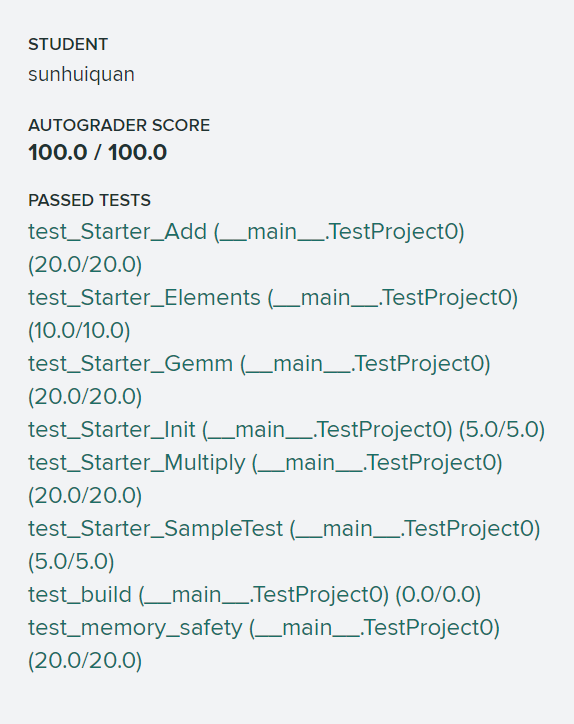
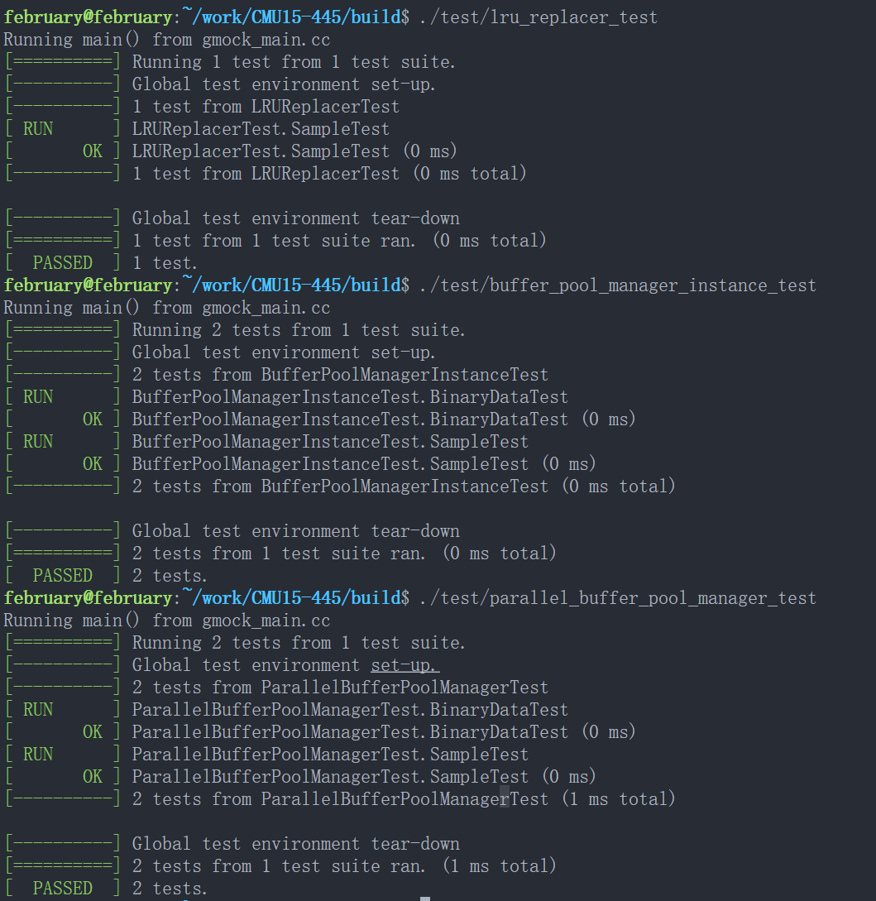
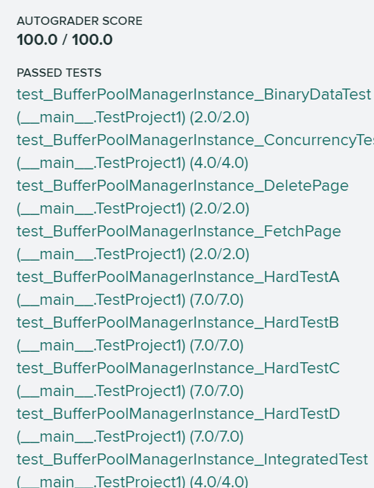

# CMU 15-445

## Index

1. [Homework](#homework)
1. [Lab 0 C++ Primer](#project-0-c-primer)
1. [Lab 1 Buffer Pool](#project-1-buffer-pool)

## Homework

1. [HW1 SQL](./homework/hw1.sql)

## Project 0 C++ Primer

### 实现

1. Matrix 是一个矩阵抽象类，里面的 rows_ 和 cols_ 就是行数和列数，我们要用一维的 T* linear_ 放下这个二维矩阵，很显然这个和我们刷力扣经常用到的一维数组表示二维数组一样，就是 linear_\[i * cols_ + j\] 表示 matrix\[i\]\[j\]。
2. RowMatrix 继承了 Matrix，然后实现各种基本矩阵的函数。
3. RowMatrixOperations 是一个针对 RowMatrix 的矩阵操作类，里面都是静态的对 RowMatrix 操作的方法。
4. 特别注意 T** data_ 的分配和释放，注意 new 先给 data_ 分配 T* 数组，之后给 data\[i\] 分配 T 数组，注意无论是 data_(T* 数组)还是 data_\[i\](T 数组)，它们都是数组，都是通过 new \[\] 分配的，所以都要 delete \[\] 释放。
	```C++
  	RowMatrix(int rows, int cols) : Matrix<T>(rows, cols) {
    	data_ = new T *[rows];
    	for (int i = 0; i < rows; ++i) {
      		data_[i] = new T[cols];
   		}
  	}

  	~RowMatrix() override {
    	for (int i = 0; i < this->rows_; ++i) {
      		delete[] data_[i];
    	}
    	delete[] data_;
  	}
	```

### 其他

1. 如果 gradescope 出现 Test Failed: False is not true : Test was not run. 
   - 可能是格式错误，使用如下指令检查格式错误。
		```bash
		make format
		make check-lint
		make check-clang-tidy
		```
   - 如果 test_build 开头告诉你 File not found in submission: src/include/primer/p0_starter.h 错误，这说明你没有按指定格式提交代码，要求你需要把 src/include/primer/ 这个层级目录也压缩，gradescope 才能找到你的文件。
   - 你可以在 test_build 测试里面复制里面的信息搜 error: 来找到底哪里出错了，这是因为本地的测试不全，有些类函数没用到所以没有编译不会报错，可能那些类函数编译错误了。
2. 因为本地测试没有测试 GEMM 函数，你可以加几个测试，如 TEST(StarterTest, GEMMTest) { // 测试代码 }
3. 默认是 DISABLED 测试的，你需要把 test 对应测试文件(/test/primer/starter_test.cpp)里面形如 TEST(StarterTest, DISABLED_InitializationTest) 去掉 DISABLED_ 变成 TEST(StarterTest, InitializationTest) 才能开启该测试函数。

  

里面第六个 GEMMTest 是我自己加的本地测试。

  

---

## Project 1 Buffer Pool

### 实现

1. lru_replacer 这个我们用双向链表 (list) 和哈希表 (unordered_map)，其中哈希表根据 frame_id 映射 list 的迭代器来定位元素，这样我们 Unpin 和 Victim 的复杂度都是 O(1)，具体思路可以看 Leetcode 146 题的题解。
2. buffer_pool_manager_instance 实现一个 buffer pool 实例，注意 page_id 可以用来定位磁盘文件中的物理块的，这部分映射不在我们这一层，只需要理解这点就行。
3. buffer_pool_manager_instance 实现不难，就是注意下和 lru_replacer 的关系即可，NewPgImp 分配后返回新分配的 frame 的地址，显然这个地址是会被调用者用的，所以是 Pin 住的；FetchPgImg 如果在 page_table_ 中就要增加 pin_count_，如果原来 pin_count_ 为 0 那么要 lru_replacer Pin 操作，如果是要 Victim，那么默认 Pin 住，类似 NewPgImg；UnpinPgImp 如果降到 0 要 lru_replacer UnPin 操作，加入 lru 池中；DeletePgImp 中如果 Pin 状态则无法删除，所以删除的都是 UnPin 状态的，所以 lru_placer 中也有这个 frame_id，删除后自然 lru 池中的也要删除，通过 lru_replacer 的 Pin 操作即可，功能是一样的，虽然意义不同。
4. parallel_buffer_pool_manager 的实现非常简单，根据 page_id 计算哈希，得到应该用哪个 buffer pool 实例，然后对应的实例调用具体的请求即可。很容易发现我们实例中的实现，对于所有的 pages_ 是共用同一个锁的，因此我们的实例其实根本并行不起来，一个实例中的并发请求光加锁保证线程安全就快变成串行了(这是因为我们一个实例就一个锁，如果实现为每个 frame 都有一个锁可以实现并行。）不过这单纯是因为思路不同罢了，这里的实现虽然实例中的并发请求几乎是串行，但 parallel_buffer_pool_mangager 有多个实例，多个实例之间实现并行，这是 bustub 的思路。
5. BufferPoolManagerInstance::AllocatePage() 是按照 buffer_pool_manager_instance 在总体中的 index 和 总数分配的，即 BPI 新分配的 page_id，经过 hash 得到的实例下标，对应的就是分配它的哪一个。

### 其他

1. 一定要千万注意不要修改非提交的文件，犯了这个错 autograde 是不会给你报错信息的，只会告诉你 The autograder failed to execute correctly，我就是因为忘记我之前在 page.h 里面加了个辅助函数，麻了。
2. DeletePgImp 要 ResetMemory，我感觉是多余的，因为 NewPageImp 会调用 ResetMemory，而 FetchPgImp 会从磁盘读取块内容覆盖，但是 autograde 里面有关于这个的测试，不得不写。

  

  

---
