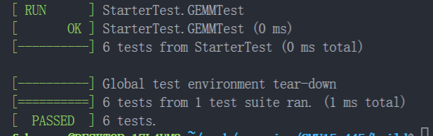
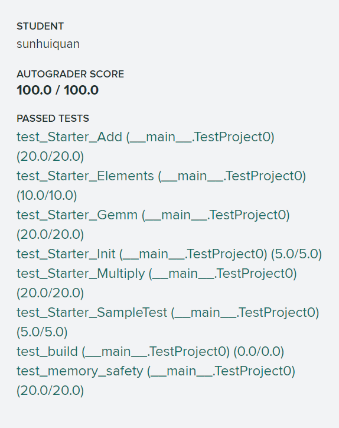

# Project 0 C++ Primer

### 实现

1. Matrix 是一个矩阵抽象类，里面的 rows_ 和 cols_ 就是行数和列数，我们要用一维的 T* linear_ 放下这个二维矩阵，很显然这个和我们刷力扣经常用到的一维数组表示二维数组一样，就是 linear_\[i * cols_ + j\] 表示 matrix\[i\]\[j\]。
2. RowMatrix 继承了 Matrix，然后实现各种基本矩阵的函数。
3. RowMatrixOperations 是一个针对 RowMatrix 的矩阵操作类，里面都是静态的对 RowMatrix 操作的方法。
4. 特别注意 T** data_ 的分配和释放，注意 new 先给 data_ 分配 T* 数组，之后给 data\[i\] 分配 T 数组，注意无论是 data_(T* 数组)还是 data_\[i\](T 数组)，它们都是数组，都是通过 new \[\] 分配的，所以都要 delete \[\] 释放。
	```C++
  	RowMatrix(int rows, int cols) : Matrix<T>(rows, cols) {
    	data_ = new T *[rows];
    	for (int i = 0; i < rows; ++i) {
      		data_[i] = new T[cols];
   		}
  	}

  	~RowMatrix() override {
    	for (int i = 0; i < this->rows_; ++i) {
      		delete[] data_[i];
    	}
    	delete[] data_;
  	}
	```

### 其他

1. 如果 gradescope 出现 Test Failed: False is not true : Test was not run. 
   - 可能是格式错误，使用如下指令检查格式错误。
		```bash
		make format
		make check-lint
		make check-clang-tidy
		```
   - 如果 test_build 开头告诉你 File not found in submission: src/include/primer/p0_starter.h 错误，这说明你没有按指定格式提交代码，要求你需要把 src/include/primer/ 这个层级目录也压缩，gradescope 才能找到你的文件。
   - 你可以在 test_build 测试里面复制里面的信息搜 error: 来找到底哪里出错了，这是因为本地的测试不全，有些类函数没用到所以没有编译不会报错，可能那些类函数编译错误了。
2. 因为本地测试没有测试 GEMM 函数，你可以加几个测试，如 TEST(StarterTest, GEMMTest) { // 测试代码 }
3. 默认是 DISABLED 测试的，你需要把 test 对应测试文件(/test/primer/starter_test.cpp)里面形如 TEST(StarterTest, DISABLED_InitializationTest) 去掉 DISABLED_ 变成 TEST(StarterTest, InitializationTest) 才能开启该测试函数。



里面第六个 GEMMTest 是我自己加的本地测试。

